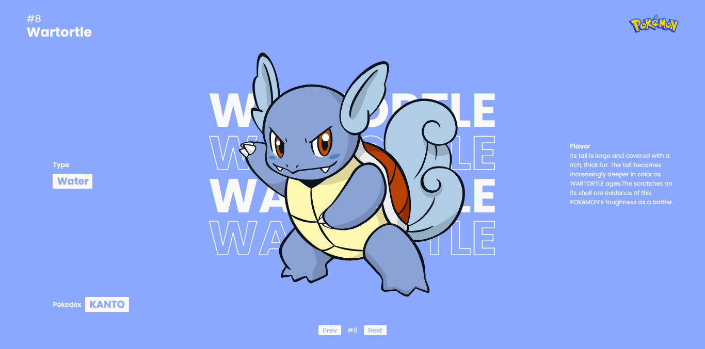
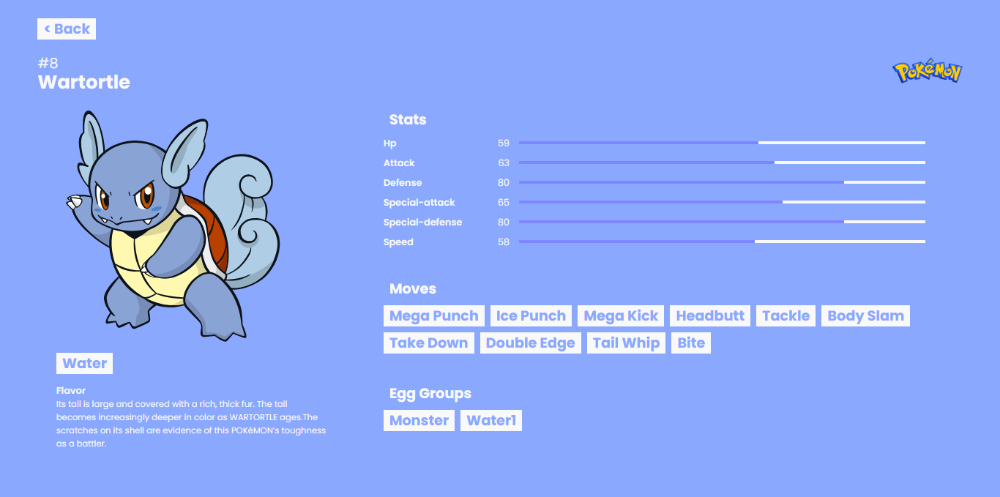

# Pokemon App
Ini merupakan sebuah web dengan tema Pokemon, data dalam web ini diambil dari API https://pokeapi.co/

# Instalasi
1.clone git repository

    git clone https://github.com/dimas3007/pokemon.git
    
2.install package
    
    npm install or yarn add

3.run the app
    
    npm start or yarn start

# Halaman Website
- List Pokemon
- Detail Pokemon ( Klik Gambar Pokemon untuk masuk )
- NotFound

# Stack yg Digunakan
- React JS
- React Redux
- Redux Thunk
- React Router Dom
- Axios
- Scss

    
# Structure Folder
Dalam pembuatan web ini saya menggunakan structure project Atomic Design, kenapa saya menggunakan ini karena Atomic Design sendiri pada dasarnya memisahkan component component menjadi yang terkecil, agar bisa digunakan pada component lainnya & lebih mudah saat proses maintenence...

namun pada project ini saya hanya menerapkan Atomic Design ini pada beberapa bagian.

# Others
Sebelum saya membuat website, saya terlebih dahulu mendesign halaman website menggunakan Adobe XD agar mempermudah proses development website ini.
berikut link download [file Design Adobe XD](https://bit.ly/xd-pokemon)

# Screenshot

